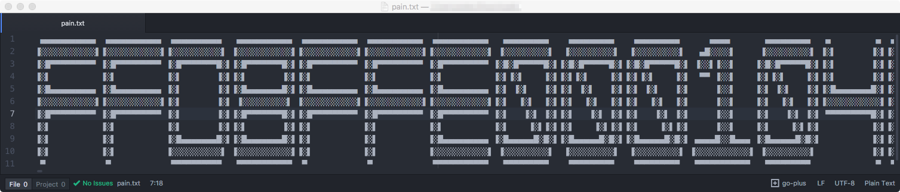
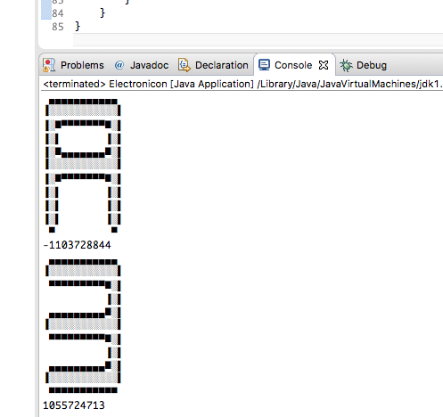
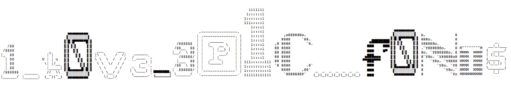

#### Belarus – Electronicon – PPC – 250 pts

Task:

------

EN: This task is one of the methods for the psychological attacks. It is intended for people who don't have heart diseases and reached 18 years ;)

h4ck1t{flag.upper()}

[pain.txt](files/pain.txt)

------

Файл весит немало, не каждый редактор сможет его открыть. После открытия видим примерно такую картину.  

Это hex-представление бинарных данных в ухищренном виде. По начальным байтам FF D8 FF E0 … мы можем предположить - что это JPG. Мы, конечно, можем ломая глаза и причиняя себе боль попытаться все это переписать ручками, но давайте все же воспользуемся навыками программирования. Тогда нам нужно понять - как этот бред привести бинарный вид.

Каждый символ состоит из 13-символьных UTF-8 символов в ширину и 11 строк в высоту. Каждая строка заканчивается на 0x0A.

**Делаем два прохода, чтобы:**

*1) понять как представлен каждый символ и сделать сопоставление;*

​	Из каждой строки последовательно вытаскиваем по 13 символов и добавляем в структуру, который хранит только уникальные ключи. Итого этих ключей у нас должно быть 16. Каждый hex-символ - это уникальная строка, в Java мы можем для них использовать их хэш-коды. Посмотрим какой хэш-код будет у каждого из них.

  

Получаем такие [значения](files/char+hashcode.txt)

*2) вывести каждый из них уже в нормальном символьном представлении.*

​	Ранее полученные коды для hex-символов добавляем в таблицу ключ-значение. Ключем будет хэш-код, значением char. Теперь заново пройдясь по файлу и сопоставляя, получаем обычную hex-строку. Декодируем ее и сохраняем полученный байтовый массив в файл.

В общем виде получим такой [код](files/Electronicon.java).

В итоге действительно получили jpg-файл, который и содержит флаг.

`h4ck1t{1_L0V3_3P1C_F0NT$}`

Вбиваем флаг и выбиваем +250 очков для **b1n4ry4rms**.

**@author: as1an**